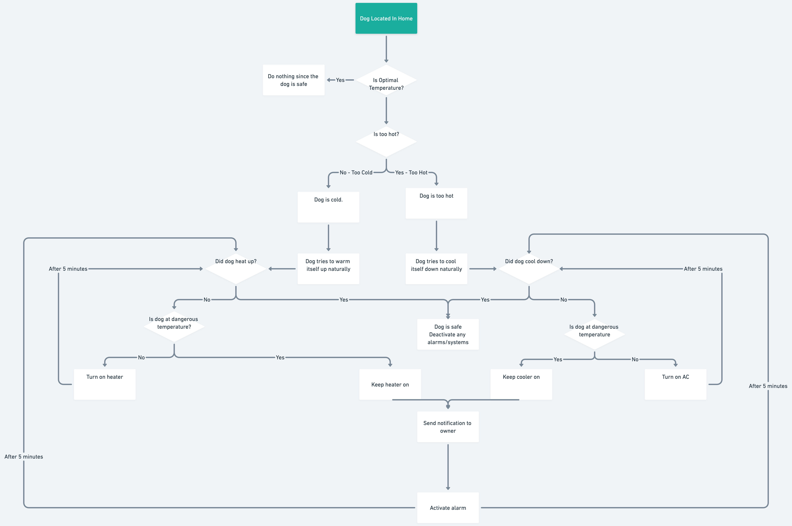
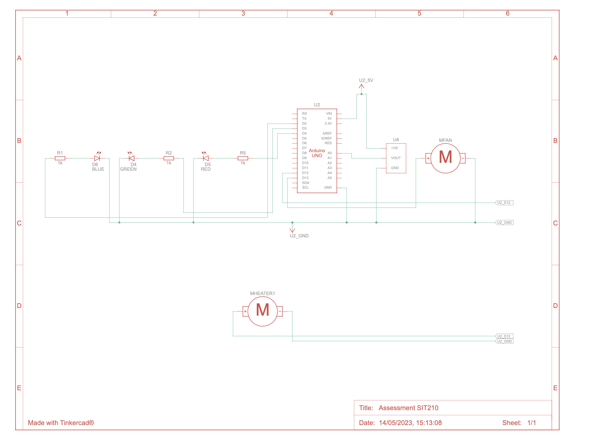
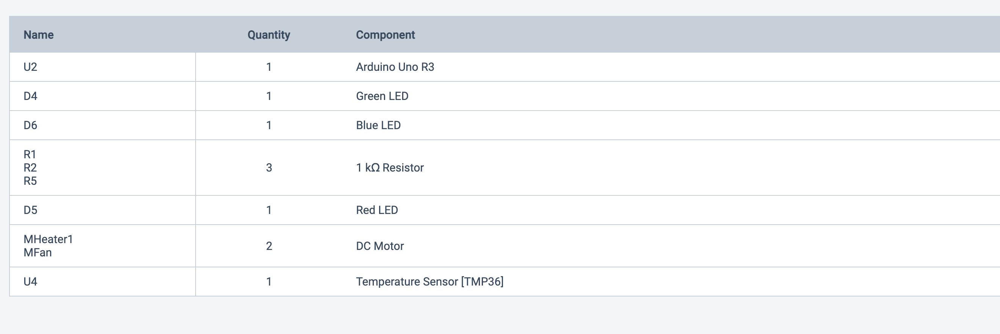

# Dog-Temperature-Regulator
SIT210 Final assessment as a dog temperature regulator

## Overview

## Why is there two files?
To ensure the code developed was in working, the simulation program Tinkercad was used for prototyping purposes.
Tinkercad was based on an Arduino device while the solution utilises a Particle Argon and a different fan and heater
from the proposed motors. Thus, there are small differences between the code to accommodate this.

### [TinkerCad Setup](./tinkercad-code.ino)

### [In-person Setup](./particle-argon-code.ino)

