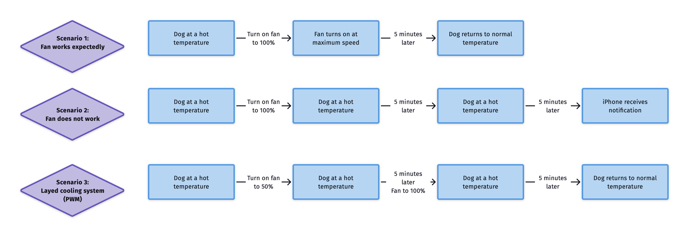
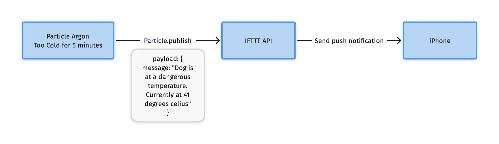

# Dog-Temperature-Regulator
This repository is Deakin University's SIT210 final assessment. We had to create an embedded software solution to an ill-defined real world problem. I decided that there is no temperature regulator's for pets in the real world. While air conditioners and heaters exist, not all houses are equipped with these. Moreover, dog jumpers and cooling pads aren't adequate for Australian summers where we have temperatures of 40 degrees celsius and above.

## Overview
The temperature regulator will measure a dog's temperature, and apply heating/cooling when needed to ensure optimal temperatures are maintained. If the dog's temperature is not being regulated expectedly and is at a dangerously high temperature, a push notification is sent to a user's phone using ITFFF. PWM and digital controls can be used for granular control of the fan to act as a multi-layered system.

## Why is there two files?
To ensure the code developed was in working, the simulation program Tinkercad was used for prototyping purposes.
Tinkercad was based on an Arduino device while the solution utilises a Particle Argon and a different fan and heater
from the proposed motors. Thus, there are small differences between the code to accommodate this.

### [TinkerCad Setup](./tinkercad-code.ino)

### [In-person Setup](./particle-argon-code.ino)

